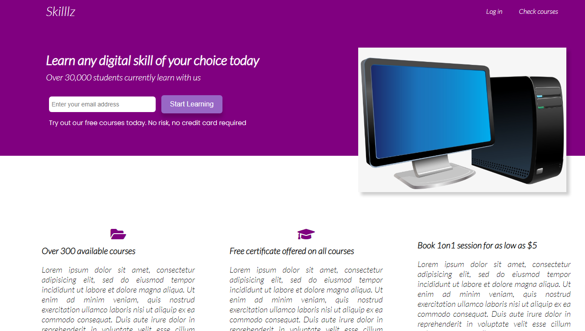
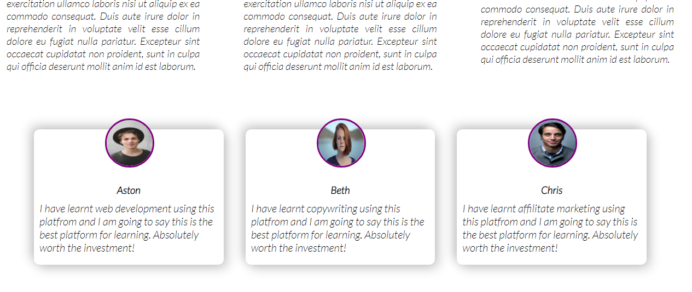
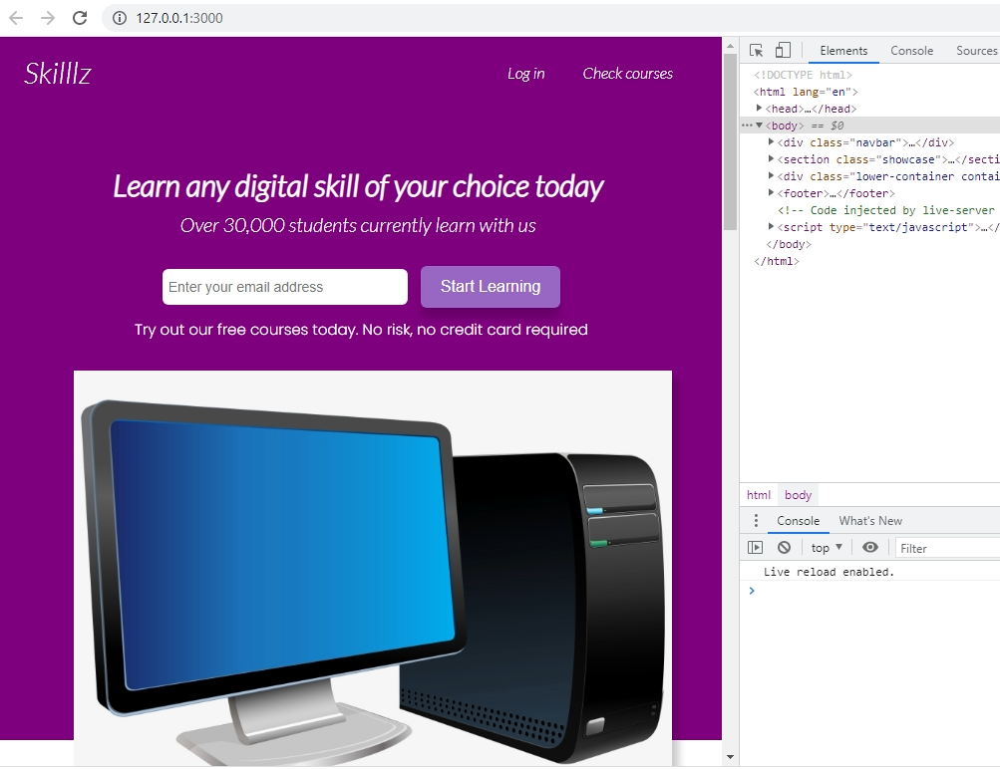
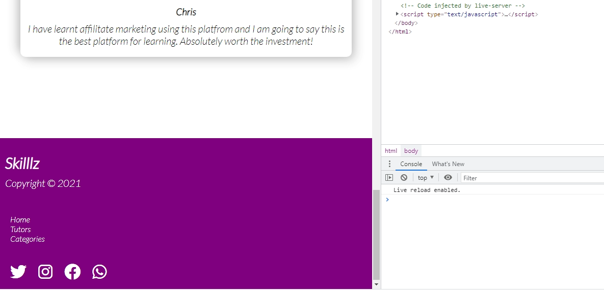
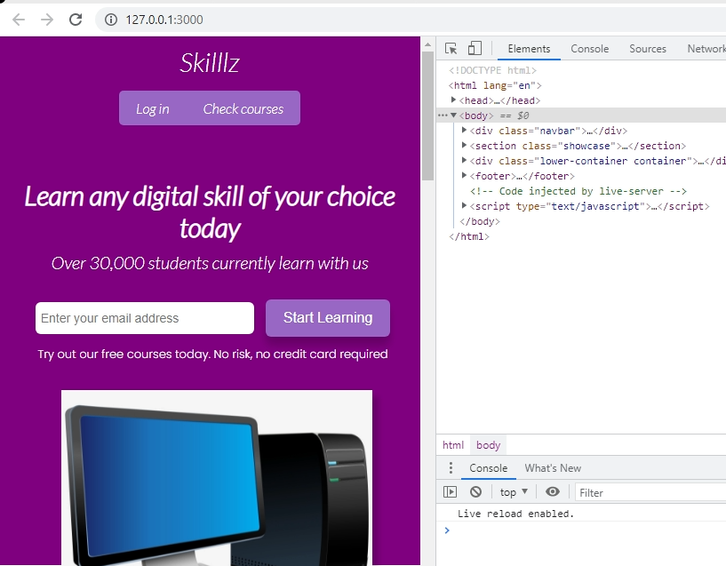
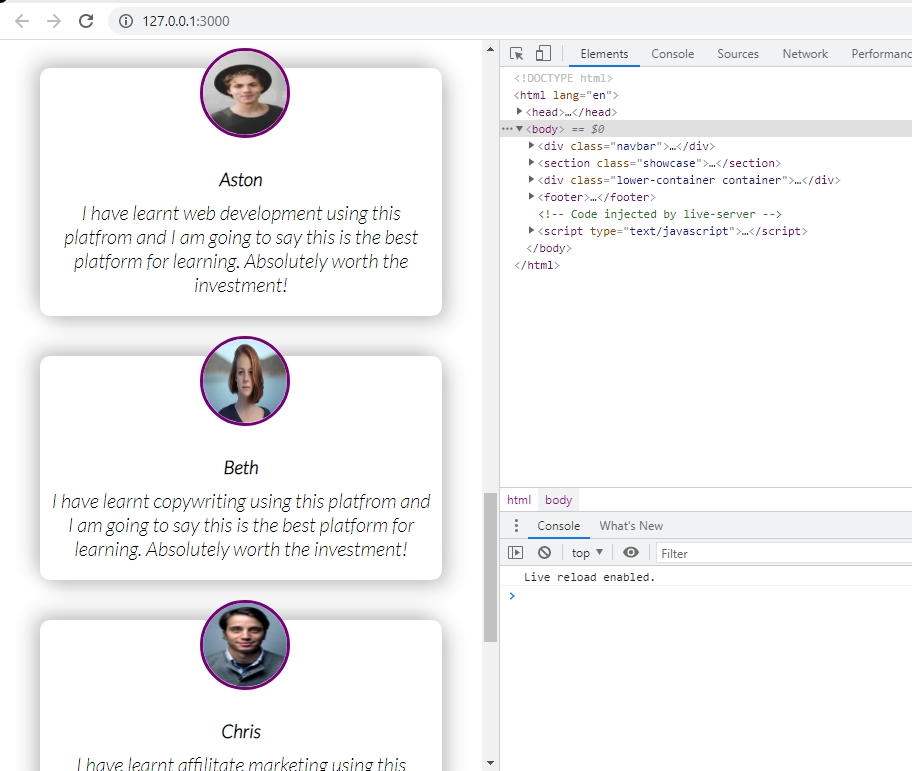
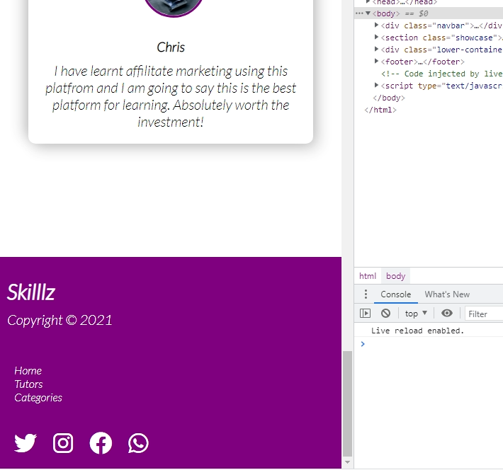

***
## A Sleek Purple Landing Page
Skilllz is an online educational platform landing page project designed using plain CSS.

The Icons are [Font Awesome Icons](https://fontawesome.com/v4.7/icons/).

The full tutorial for this project is published on [FreeCodeCamp.](https://www.freecodecamp.org/news/css-flexbox-and-grid-tutorial/)

> You are free to fork this project. I will also appreciate a star, if you like this project.

## SCREENSHOTS

***

***

### RESPONSIVE (TABLETS)
On tablets, this is how our landing page will look like.

***

***

### RESPONSIVE (MOBILE SCREENS)
On mobile devices with smaller screens.

***

***

